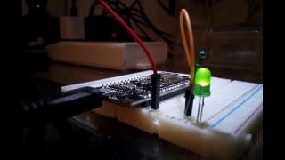

# ESP8266 LoLin V3 NodeMCU


These are my notes for flashing and programming the LoLin V3 ESP8266 ESP-12E
CH340G WIFI Network Development Board. This may work on other ESP8266 based
boards as well. This is for Linux only and specifically on Ubuntu 16.04 x84-64.
I suspect it will work on other Linux distributions as well.

## Where to get a ESP8266
I bought 5 on ebay with shipping they were about $3.59 US each. They come from 
China at that price, so you are going to wait a few weeks to reach the US.
Search EBay for "NodeMcu Lua ESP8266 ESP-12E" The [LoLin](https://www.wemos.cc)
ones I bought came with 4 MB flash. This particular board is too wide for a
standard breadboard.

## Verify device shows up
You want to make sure Ubuntu discovers your device. I just plugged it in
without any additional drivers and it showed up. I used a standard micro USB
cable to connect to PC. 
* `lsusb`
* `Bus 006 Device 002: ID 1a86:7523 QinHeng Electronics HL-340 USB-Serial adapter`
* Device should show up as serial port /dev/ttyUSB0 if something doesn't
already occupy that port.

## Flash device
This will bring your device up to the latest NodeMCU release. I used the dev
branch with floating point.
* Use [NodeMCU custom builds](https://nodemcu-build.com) to create a NodeMCU
image.
    * I selected dev branch and used pre-selected defaults.
* Make sure you can do serial communications without root access
    * `sudo usermod -a -G dialout username` (Use a non-root username)
    * You will have to log out or reboot for this to take effect.
* Install esptool.py
    * `sudo -H pip install esptool`
* Verify esptool can communicate with device.
    * `esptool.py chip_id`
    ```esptool.py v2.3.1
    Connecting....
    Detecting chip type... ESP8266
    Chip is ESP8266EX
    Features: WiFi
    Uploading stub...
    Running stub...
    Stub running...
    Chip ID: 0x00000000
    Hard resetting via RTS pin...
    ```
 * Check flash size.
    * `esptool.py flash_id`
    * `Detected flash size: 4MB`
* Blow away flash.
    * `esptool.py erase_flash`
* Flash image with file you downloaded. Replace file name at end of command.
    * `esptool.py write_flash --flash_mode dio 0x00000 nodemcu-dev-7-modules-2018-03-10-17-09-58-float.bin`
    
## Install ESPlorer
I'm using ESPlorer, but Arduino IDE could probably be used as well.
* Install Java 8 JDK if you do not have Java installed.
* Download latest [ESPlorer.zip](esp8266.ru/esplorer-latest/?f=ESPlorer.zip)
* Extract to ~/
* Run ESPlorer
    * `cd ~/ESPlorer`
    * `java -jar "ESPlorer.jar"`
    * NodeMCU dev branch uses 115200 baud, bot 9600. It should auto detect the
    port.
    * Click on Open, click RTS twice and device should auto detect
    ```ORT OPEN 115200

       Communication with MCU..Got answer! Communication with MCU established.
       AutoDetect firmware...

       Can't autodetect firmware, because proper answer not received (may be unknown firmware). 
       Please, reset module or continue.

       NodeMCU custom build by frightanic.com
	       branch: dev
	       commit: 5c8af3c452574448d471e271231b36ac3fff6b1b
	       SSL: false
	       modules: file,gpio,net,node,tmr,uart,wifi
        build 	built on: 2018-03-10 17:08
        powered by Lua 5.1.4 on SDK 2.1.0(116b762)
       lua: cannot open init.lua
       > 
    ```
    
 ## Run code on ESP
 Let's try a simple function to list WIFI APs.
* Copy code to the editor on the left side of ESPlorer.
```-- Print AP list that is easier to read
function listap(t) -- (SSID : Authmode, RSSI, BSSID, Channel)
    print("\n"..string.format("%32s","SSID").."\tBSSID\t\t\t\t  RSSI\t\tAUTHMODE\tCHANNEL")
    for ssid,v in pairs(t) do
        local authmode, rssi, bssid, channel = string.match(v, "([^,]+),([^,]+),([^,]+),([^,]+)")
        print(string.format("%32s",ssid).."\t"..bssid.."\t  "..rssi.."\t\t"..authmode.."\t\t\t"..channel)
    end
end
```
* Select all the code in the editor.
* Click Block button and code should upload to ESP.
* Clear editor and paste `wifi.sta.getap(listap)`
* Put cursor on line and click Line button
```
> wifi.sta.getap(listap)
> 
                            SSID	BSSID				  RSSI		AUTHMODE	CHANNEL
                            test	e7:98:f1:45:36:b8	  -47		3			3
                        SXE465TF	21:e7:1a:88:9b:c5	  -65		3			11
                            xyz1	49:e1:1c:52:65:c6	  -64		4			11
```

## Blink LED
[](https://youtu.be/BGgfGz3rAVs)
This uses a init.lua and blink.lua script to flash an LED on boot. Change pin
number in blink.lua as needed.
